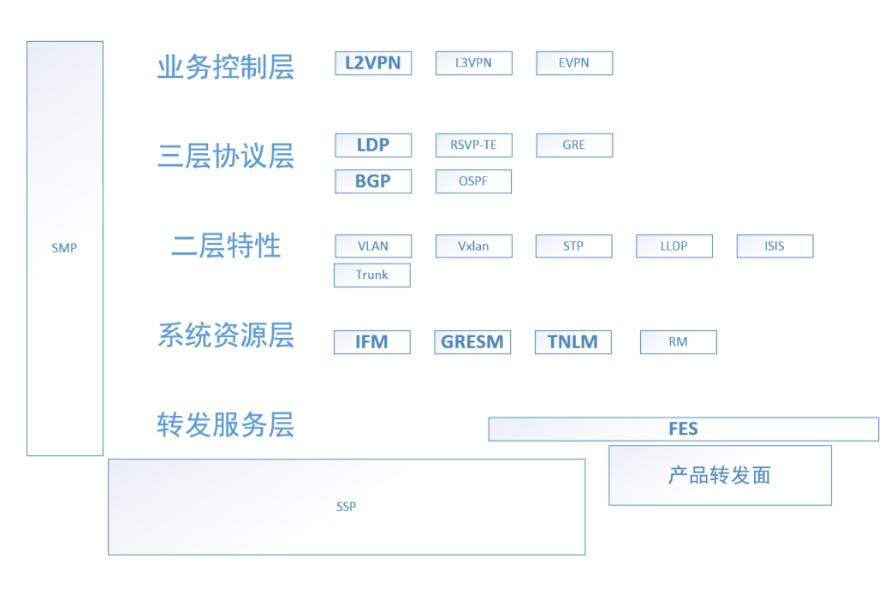
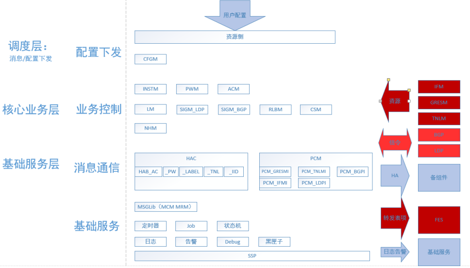
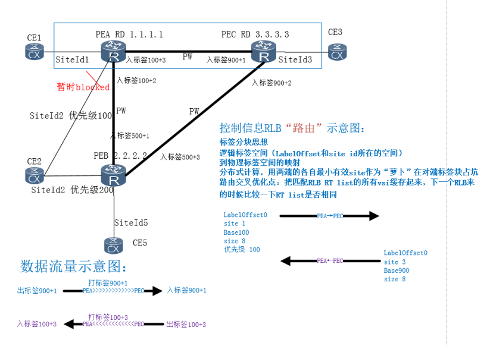
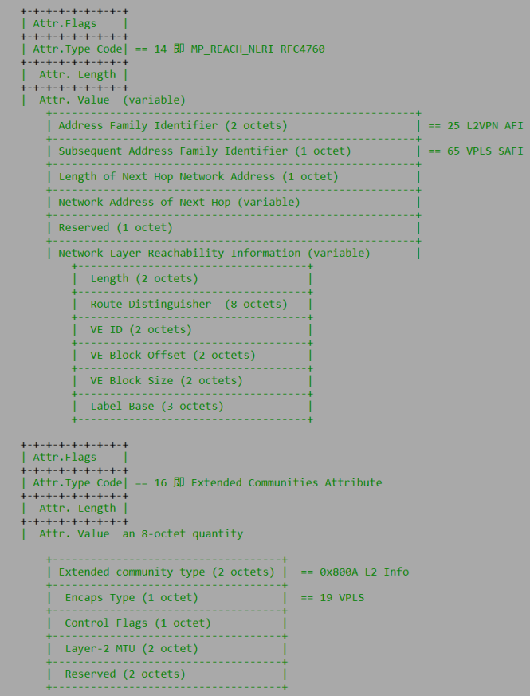
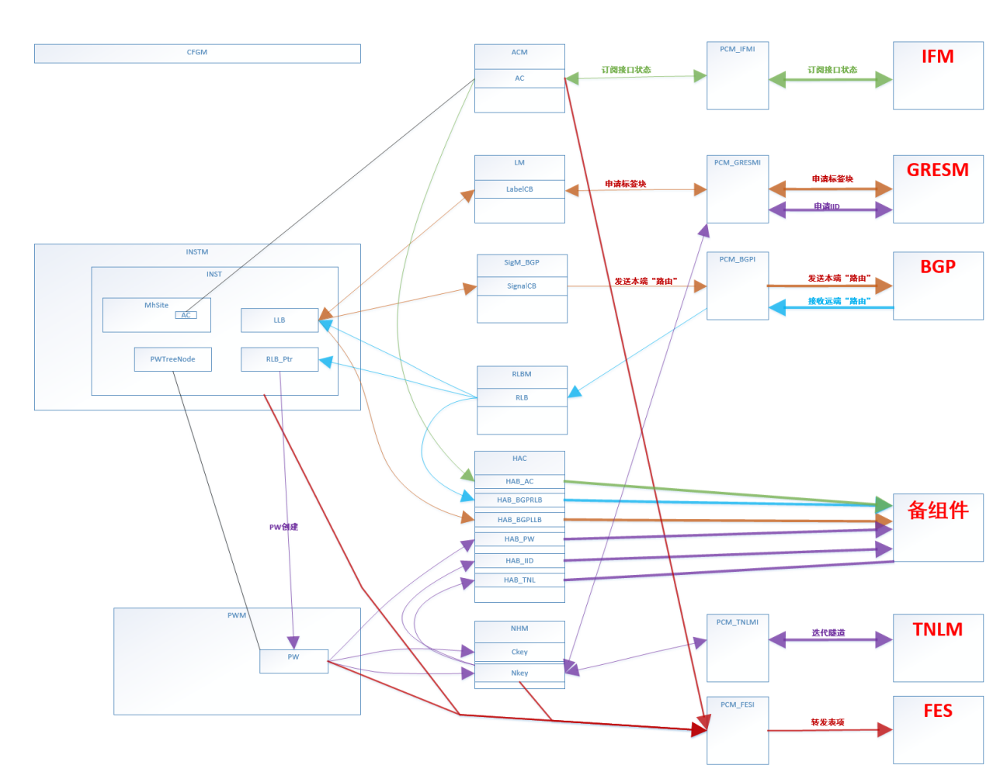

# 目录
[简历](./resume2017.md)

[1.nos-vrp-大概层次模块划分](#1nos-vrp-大概层次模块划分)

[2.l2vpn组件分层模块划分](#2l2vpn组件分层模块划分)

[3.L2VPN组件multihoming场景简介](#3L2VPN组件multihoming场景简介)

[4.L2VPN组件multihoming报文格式](#4L2VPN组件multihoming报文格式)

[5.l2vpn组件multihoming业务模块交互](#5l2vpn组件multihoming业务模块交互)

# 1.NOS-VRP-大概层次模块划分

# 2.L2VPN组件分层模块划分

# 3.L2VPN组件multihoming场景简介

# 4.L2VPN组件multihoming报文格式

# 5.L2VPN组件multihoming业务模块交互

